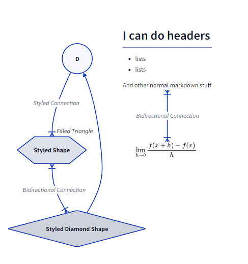

<div align="center">
<h1>D2.Net</h1>
    <a href="https://github.com/terrastruct/d2">
        
    </a>
<h3>
A .NET Library for programatically creating D2 Templates.
</h3>

[D2 Language](https://github.com/terrastruct/d2) created by Terrastruct


[](https://www.nuget.org/packages/D2.Net/)


</div>

## About

This library aims to provide a simple and expressive way to create D2 templates that can be easily integrated into any .NET application. Enabling easy generation of diagrams for documentation, reports, and more based off of data from your application.

Currently this library is in early development and not all D2 features are supported, see below for a high level list of supported features.

### Supported D2 Features

- [x] Shapes
  - [x] Labels
  - [x] Containers / Children
  - [x] Styling
- [x] Connections
  - [x] Labels
  - [x] Arrow Styling/Directions
  - [ ] Styling
- [ ] Tooltips / Links
- [x] Icons
- [x] Standalone Text / Markdown / LateX
- [ ] Sequence Diagrams
- [ ] UML/Class Diagrams
- [ ] SQL Table Diagrams

## Installation

D2.Net is available on [NuGet](https://www.nuget.org/packages/D2.Net/).

```bash
dotnet add package D2.Net
```

## Usage

Here is an example of creating a fairly complex template using D2.Net with most of the implemented features.

You can check Examples to see this and a more basic setup.

```csharp
using D2;

var styledTemplate = Diagram.Create()
    .CreateShape("D", type: ShapeType.Circle)
    .CreateShape("E", "Styled Shape", ShapeType.Hexagon)
    .CreateShape("F", "Styled Diamond Shape", ShapeType.Diamond)
    .CreateDirectionalConnection("D", "E", "Styled Connection", new ArrowheadOptions(ArrowheadType.CrowsFootManyRequired, "Filled Triangle"))
    .CreateBidirectionalConnection("E", "F", "Bidirectional Connection",
        new ArrowheadOptions(ArrowheadType.CrowsFootManyRequired),
        new ArrowheadOptions(ArrowheadType.CrowsFootManyRequired))
    .CreateConnection("F", "D")
    .CreateMarkdownShape("G", @"  # I can do headers

  - lists
  - lists

  And other normal markdown stuff")
    .CreateLatexShape("H", @"\\lim_{h \\rightarrow 0 } \\frac{f(x+h)-f(x)}{h}")
    .CreateBidirectionalConnection("G", "H");

Console.WriteLine(styledTemplate);
```
This will output the following D2 code:

```d2
D: {
  shape: circle
}
E: Styled Shape {
  shape: hexagon
}
F: Styled Diamond Shape {
  shape: diamond
}
D -> E: Styled Connection {
  target-arrowhead: Filled Triangle { shape: cf-many-required; style.filled: true }
}
E <-> F: Bidirectional Connection {
  source-arrowhead: { shape: cf-many-required; style.filled: true }
  target-arrowhead: { shape: cf-many-required; style.filled: true }
}
F -> D
G: |md
  # I can do headers

  - lists
  - lists

  And other normal markdown stuff|
H: |latex
\\lim_{h \\rightarrow 0 } \\frac{f(x+h)-f(x)}{h}|
G <-> H: Bidirectional Connection {
  source-arrowhead: { shape: cf-many-required; style.filled: true }
  target-arrowhead: { shape: cf-many-required; style.filled: true }
}

```
That is rendered to the following diagram, using the [D2 Playground]([https://play.d2lang.com/?script=crRSCC5JLCrJzEtXCMjPzCvhcrJScM1LQfCdrRR8M1NSclIhfIVqLgUFBYXijMSCVCuFjNSKxPT8PK5aLkcFXTsFZy5nEOVkpeCRmpOTrxCeX5STosgFCAAA__8%3D&](https://play.d2lang.com/?script=1JBBi9swFITv71cM9JJQXHpWS6Ct66Tn9GhYhPVsiZWl3WeZONj-74sdyIYllxz3JphPM_MmVxgJ6Kx-YYXKSeWZZvqrcExnzwbHRbllLA-6iYFmKq5Q7nQbwx3YXASaKUe2w7vtnxgCV8nFsOJJS8Mp0yLxZFkbhcL5hfsvTofGM8ZrxzprdThnwq-9EzY_0C2W3-r1g0KSnjEvN-BntkOh8NsZJ5cw7T8md7GXim-TH0261_7xtsWyT057hak1BHzBP1Q6wEQsliwdEZDBuy51Ny8CfgWDmCwLQpRWe7Rank08BXSpr-uJDgqT14kHKkvv2qfRoizFNTatlfEdM8qyFl2N9Wb4ardZvRm282jnifbriodPsuJbAAAA__8%3D&sketch=0&))!

